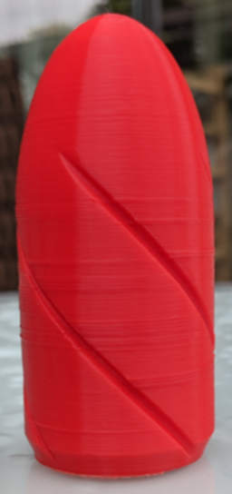
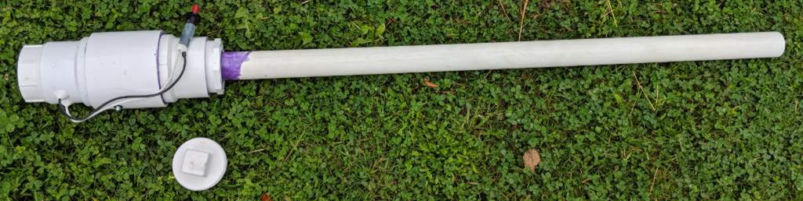
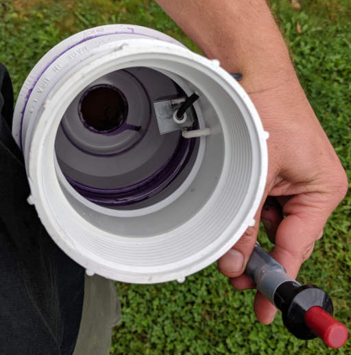

# potato_cannon
Various potato cannon related goodies

## Disclaimer

I take no responsibility for any damage you manage to do to yourself,
others, or property.  You have to use your own common sense and avoid
injuring yourself or others, breaking windows, denting cars, etc...  If you
cannot take the necessary precautions to experiment safely then don't build
a potato cannon. 

## What's Here

This repo contains an OpenSCAD design for a rifled slug to fit a bog standard potato cannon using a barrel made from 1 1/2 inch schedule 40 PVC pipe.

My setup to produce these slugs goes like so:
1. Using OpenSCAD (I currently use the 2015.03-2 version) render and export to STL.  There are several tweakable parameters described in the file:
  * hollow -- Hollow out the center (except for the leading edge).
  * shrinkage_comp -- Scale the print to compensate for its shrinking as it cools.
  * rifle -- Whether to rifle the slug or leave it plain.
  * There are more things that could be tweakable or made parametric but this seemed like a good start.
2. I then slice the resulting .stl file in Slic3r using the following settings:
  * Bottom Solid Layers: 10
  * Top Solid Layers: 10
  * Perimeters: 10 (less if making a hollow projectile to fill with silicone rubber)
  * Layer Height: 0.2mm
  * Infill: 3D Honeycomb
  * Infill Density: between 25% and 75% depending on how much mass you want in your projectile.
3. Print the resulting gcode file according to whatever method works best with your printer.
4. Post Processing (optional):
  * Sand the layer texture to smooth it a bit)
  * Plug the bottom couple millimeters of the rifling with beeswax so that your fuel gas stays contained longer between loading and firing.
5. Go outside and launch the thing **somewhere safe**.
  * Consider that this thing has a _much_ longer range with an aerodynamic and stabilized projectile than it does with a tumbling chunk of potato.
  * Consider that even a fairly light weight PLA projectile will hurt like a bastard if it hits you at ~200 miles an hour.
  * Wear safety glasses since PLA slugs (or potatos for that matter) can easily shatter on impact with a hard surface and distribute smithareens over a wide area and you'll be much happier if that wide area doesn't include the tender surface of your eyeball.
  * Be damn sure there is nothing you don't want to smash downrange as this thing shoots _far_.

## Reference Implementation of a Spud Gun

My potato cannon is fairly vanilla as combustion powered spud guns go... As mentioned above, it uses a chamber made from a 4 inch PVC coupler with a 4in-to-3in reducer and a 3in cleanout cap on the butt end and a 4in-to-3in reducer followed by a 3in-to-1½in coupler on the barrel end and a 1½in barrel.  It's built from schedule 40 PVC pipe and cemented together using PVC cement (the normal solvent welding process one always uses for PVC).

I am using a gas BBQ grill piezoelectric igniter for a trigger and MAPP gas for the fuel charge (while the old AquaNet hair spray standby works well it tends to leave a sticky buildup over time that eventually interferes with the spark, and also the residual moisture makes repeated firings unreliable).

In addition I used a liberal puddle of PVC cement to fasten a short (~2cm) length of ½in pipe parallel to but inside the barrel at the chamber end to act as a stop for the projectile when using a ramrod to load the potato / slug / whatever.  It's just glommed on to the inner wall.

One more aspect of this design that's interesting is that since the threaded cap on the butt end is so easy to remove one might swap out the plain one for one with inlet and outlet valves if you wanted to use the regulator from an Oxy-Acetylene welding torch to charge the cannon, or swap back in your plain endcap for use with hairspray or other "spray-in-and-seal" type fuels.

